# OpenClaw - System Design Document

> **Version:** 1.0
> **Date:** 2026-02-13
> **Audience:** Internal reference & new contributors
> **Status:** Living document

---

## Table of Contents

1. [Overview](#1-overview)
2. [High-Level Architecture](#2-high-level-architecture)
3. [Core Components](#3-core-components)
4. [Voice Pipeline (Cheeko)](#4-voice-pipeline-cheeko)
5. [Multi-Channel Messaging](#5-multi-channel-messaging)
6. [Agent & LLM Orchestration](#6-agent--llm-orchestration)
7. [Plugin & Extension System](#7-plugin--extension-system)
8. [Configuration System](#8-configuration-system)
9. [Session & State Management](#9-session--state-management)
10. [Security Architecture](#10-security-architecture)
11. [Data Models & Key Types](#11-data-models--key-types)
12. [API Reference](#12-api-reference)
13. [Frontend & Native Apps](#13-frontend--native-apps)
14. [Deployment Architecture](#14-deployment-architecture)
15. [Development Workflow](#15-development-workflow)
16. [Observability & Diagnostics](#16-observability--diagnostics)
17. [Roadmap & Future Directions](#17-roadmap--future-directions)

---

## 1. Overview

### What is OpenClaw?

OpenClaw is a **personal AI assistant platform** that you run on your own devices. It acts as a unified gateway between you and multiple AI models (Claude, GPT, Gemini) across 40+ messaging channels (WhatsApp, Telegram, Slack, Discord, Signal, iMessage, Teams, Matrix, and more), with real-time voice conversation support.

### Design Philosophy

- **Local-first:** All data, sessions, and credentials stay on your machine by default
- **Multi-channel:** One assistant, reachable everywhere — same context across all channels
- **Extensible:** Plugin SDK for custom channels, tools, and integrations
- **Model-agnostic:** Swap LLM providers without changing your workflow
- **Voice-native:** First-class voice conversation with streaming STT/TTS

### Tech Stack Summary

| Layer | Technology |
|-------|-----------|
| **Gateway (control plane)** | Node.js 22+, TypeScript (ESM), Express, WebSocket |
| **Voice Pipeline (Cheeko)** | Custom WebSocket streaming, Deepgram STT, OpusScript codec |
| **TTS Providers** | OpenAI TTS API, ElevenLabs, Edge TTS (node-edge-tts) |
| **LLM Providers** | Anthropic Claude, OpenAI GPT, Google Gemini, Ollama |
| **Telephony** | Voice-call extension (Twilio, Telnyx, Plivo) |
| **Frontend** | React + Vite (web UI), vanilla JS (voice client) |
| **Native Apps** | Swift/SwiftUI (macOS/iOS), Kotlin (Android) |
| **Package Management** | pnpm 10.23+ |
| **Testing** | Vitest (V8 coverage, 70% threshold) |
| **Deployment** | Docker, Fly.io, Render, systemd/launchd |

---

## 2. High-Level Architecture

### System Context

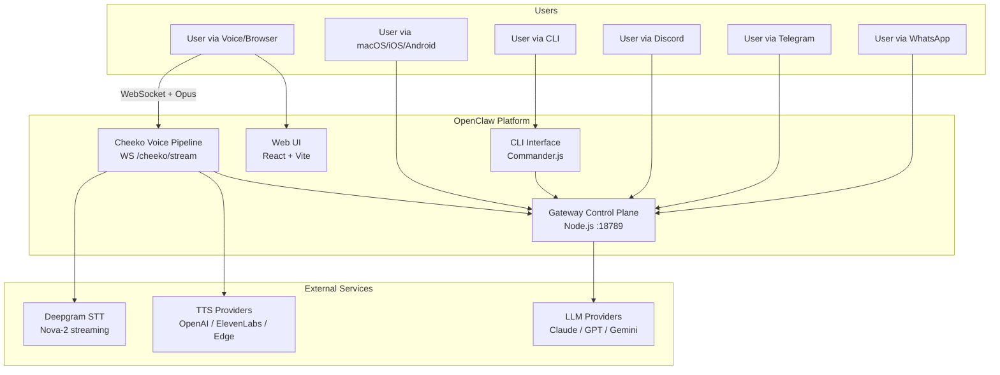

### Component Interaction

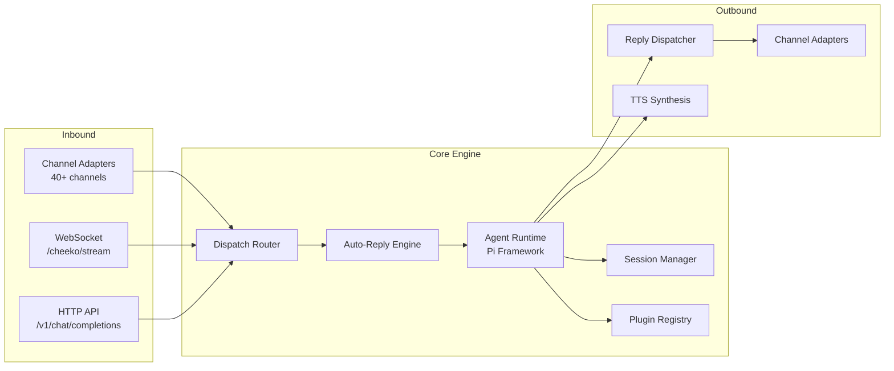

---

## 3. Core Components

### 3.1 Gateway Control Plane

The gateway is the heart of OpenClaw — a WebSocket-based control plane that orchestrates all messaging, agent execution, and real-time communication.

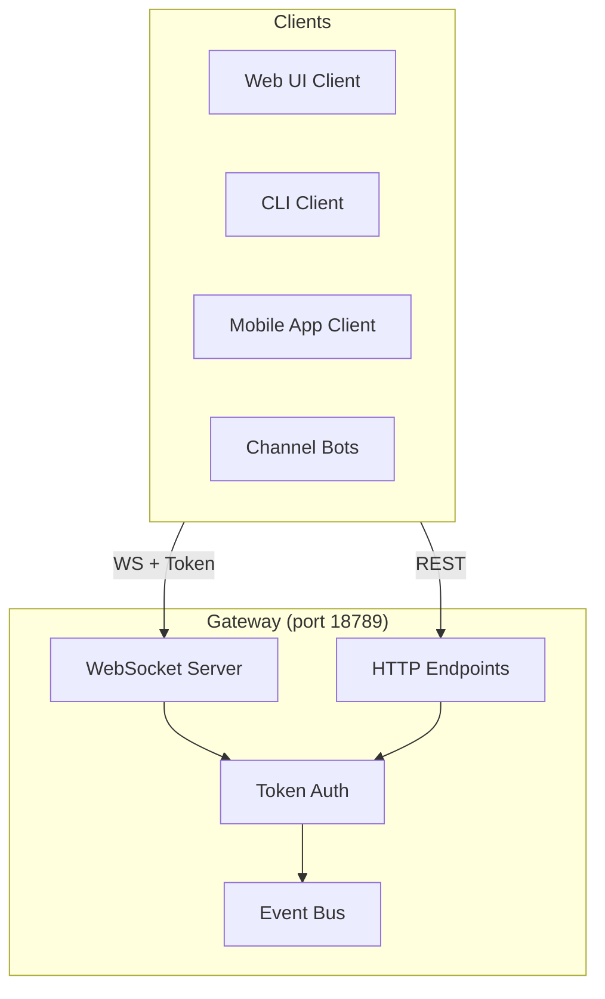

**Key properties:**
- **Default bind:** `127.0.0.1:18789` (loopback only for security)
- **Configurable bind modes:** `local`, `lan`, `remote`
- **Max payload:** 25MB (for large LLM responses)
- **Heartbeat interval:** 30 seconds
- **Client modes:** `BACKEND`, `EMBEDDED`, `WEB_UI`
- **Authentication:** Token-based with device identity signing + TLS fingerprint validation

**Entry points:**

| File | Purpose |
|------|---------|
| `src/index.ts` | Main CLI bootstrapper — loads env, validates runtime, builds Commander program |
| `src/entry.ts` | Process-level bootstrap — respawn guards, Windows compat, error handlers |
| `src/gateway/client.ts` | `GatewayClient` class — WS connection with auto-reconnect and request/response correlation |
| `src/gateway/boot.ts` | Boot sequence — reads optional `BOOT.md` and runs startup instructions |

### 3.2 CLI Interface

OpenClaw provides a comprehensive CLI built with Commander.js:

```
openclaw
├── gateway         # Start/manage the gateway
├── onboard         # First-time setup wizard
├── agent           # Run agent commands
├── channels        # Channel management & status
├── config          # Configuration management
├── doctor          # Diagnostic checks
├── cron            # Scheduled task management
├── plugins         # Plugin management
├── nodes           # Node device management
├── message         # Send messages programmatically
├── logs            # View structured logs
├── dashboard       # Terminal dashboard
└── update          # Update to stable/beta/dev channel
```

### 3.3 Build System

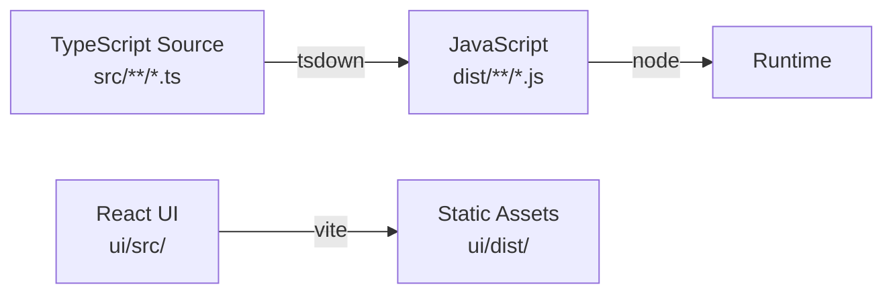

| Tool | Purpose |
|------|---------|
| `tsdown` | TypeScript bundler (ESM output) |
| `tsx` | TypeScript executor for development |
| `oxlint` | Rust-based linter |
| `oxfmt` | Rust-based formatter |
| `vitest` | Test runner with V8 coverage |
| `vite` | React UI bundler |

---

## 4. Voice Pipeline (Cheeko)

The voice system ("Cheeko") provides real-time voice conversations via a custom WebSocket-based pipeline built entirely in Node.js/TypeScript. Clients connect over WebSocket, send Opus or PCM audio frames, and receive spoken responses back as audio frames.

### 4.1 Voice Architecture

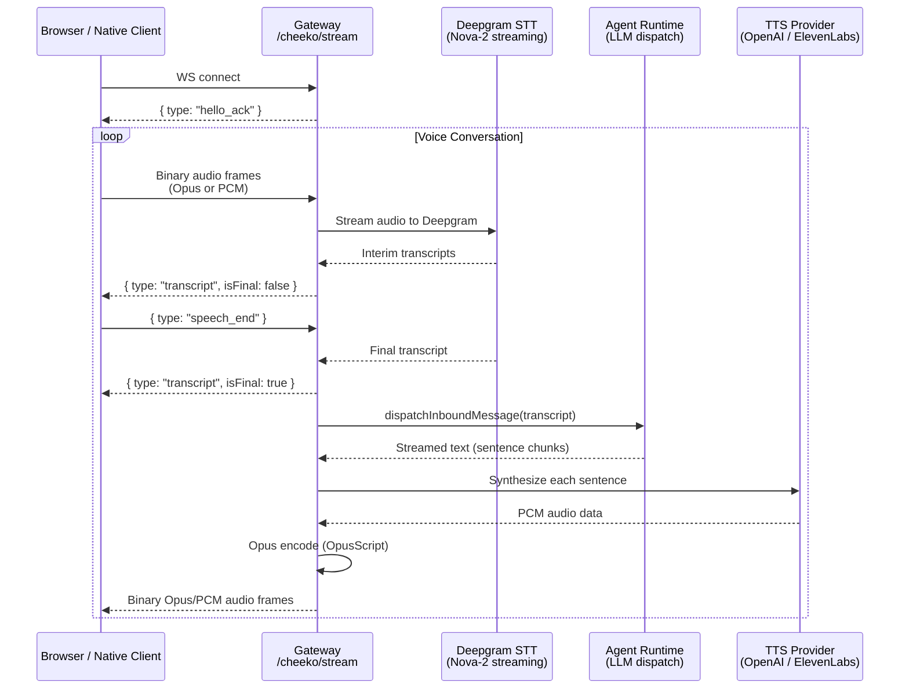

### 4.2 Cheeko Stream Handler

The voice pipeline is implemented across five files in `src/gateway/`:

| File | Purpose |
|------|---------|
| `cheeko-stream.ts` | WebSocket server, per-connection session state, audio routing |
| `cheeko-stt.ts` | Deepgram SDK integration — streaming STT with VAD events |
| `cheeko-chat.ts` | Bridges transcript to agent runtime, sentence-buffered response streaming |
| `cheeko-tts.ts` | OpenAI TTS provider + Opus encoding (OpusScript) |
| `cheeko-tts-elevenlabs.ts` | ElevenLabs TTS provider + Opus encoding |

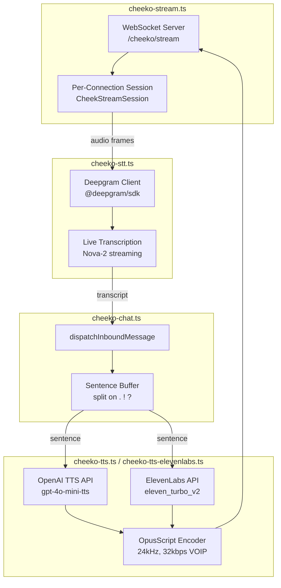

### 4.3 Per-Connection Session

Each WebSocket connection creates a `CheekStreamSession`:

```typescript
type CheekStreamSession = {
  sessionId: string
  deviceId: string
  ws: WebSocket
  state: "idle" | "listening" | "processing" | "speaking"
  chatHistory: Array<{ role: string; content: string }>
  audioFormat: "opus" | "pcm"     // opus for native, pcm for web
  sttStream: CheekSttStream | null
  finalTranscript: string
  chatHandle: CheekChatHandle | null
  ttsPipeline: CheekTtsPipeline | null
  speechEndAt: number             // for latency measurement
  firstAudioSent: boolean
}
```

### 4.4 STT — Deepgram Integration

The STT module (`cheeko-stt.ts`) uses the Deepgram SDK for streaming transcription:

- **Provider:** Deepgram Nova-2 (configurable model)
- **Encoding:** Opus (native clients) or Linear16/PCM (web clients)
- **Sample rate:** 16kHz, mono
- **Features:** Punctuation, interim results, endpointing (300ms), utterance end (1000ms), VAD events, smart formatting
- **API key:** Via config (`deepgramApiKey`) or `DEEPGRAM_API_KEY` env var

### 4.5 TTS — Multi-Provider Support

TTS is selected per-connection based on `config.ttsProvider`:

| Provider | Module | Audio Format | Key Config |
|----------|--------|-------------|------------|
| **OpenAI** (default) | `cheeko-tts.ts` | PCM 24kHz → Opus | `openaiApiKey`, voice selection |
| **ElevenLabs** | `cheeko-tts-elevenlabs.ts` | PCM 24kHz → Opus | `elevenlabsApiKey`, `elevenlabsVoiceId`, `elevenlabsModelId` |
| **Edge TTS** | `node-edge-tts` (core dep) | Via native apps / talk extension | Built-in, no API key needed |

Both OpenAI and ElevenLabs TTS modules:
1. Request PCM audio (24kHz, 16-bit mono) from the provider
2. Encode to Opus frames using OpusScript (32kbps, VOIP mode, 20ms frames)
3. Deliver frames to the client via WebSocket

### 4.6 Chat Bridge

The chat module (`cheeko-chat.ts`) bridges voice transcripts to the agent runtime:

1. Receives final transcript text
2. Creates a `MsgContext` and calls `dispatchInboundMessage` (same path as text channels)
3. Subscribes to agent events for streamed response
4. Accumulates text deltas into a **sentence buffer** (splits on `.` `!` `?`)
5. Fires `onTextChunk` for each complete sentence (triggers TTS)
6. Fires `onComplete` when the full response is done
7. Registers conversation in `default#voice` session key

### 4.7 WebSocket Protocol

**Endpoint:** `WS /cheeko/stream`

**Client → Server:**

| Type | Format | Description |
|------|--------|-------------|
| `hello` | JSON | `{ type: "hello", deviceId?: string, token?: string, clientType?: string }` |
| `speech_end` | JSON | `{ type: "speech_end" }` — signals end of user utterance |
| `cancel` | JSON | `{ type: "cancel" }` — abort current response |
| Audio frames | Binary | Raw Opus or PCM audio data |

**Server → Client:**

| Type | Format | Description |
|------|--------|-------------|
| `hello_ack` | JSON | Connection acknowledged |
| `status` | JSON | `{ type: "status", stage: "listening" | "processing" | "speaking" }` |
| `transcript` | JSON | `{ type: "transcript", text: string, isFinal: boolean }` |
| `error` | JSON | `{ type: "error", message: string }` |
| Audio frames | Binary | Opus or PCM response audio |

### 4.8 Voice-Call Extension (Telephony)

The `extensions/voice-call/` extension adds telephone voice support via SIP/PSTN providers:

- **Providers:** Twilio, Telnyx, Plivo (pluggable)
- **Features:** Inbound/outbound calls, TTS response generation, webhook security
- **Architecture:** Provider adapters implement a common `base.ts` interface
- **TTS:** Dedicated `telephony-tts.ts` with OpenAI TTS for phone calls

---

## 5. Multi-Channel Messaging

### 5.1 Channel Architecture

OpenClaw uses an **adapter pattern** where each messaging platform implements a common `ChannelPlugin` interface. Channels are split into two tiers:

- **Core chat channels** — registered in `src/channels/registry.ts` (`CHAT_CHANNEL_ORDER`), with protocol logic in `src/<channel>/` and docks hard-coded in `src/channels/dock.ts`
- **Extension channels** — loaded at runtime from `extensions/`, registered via the plugin system

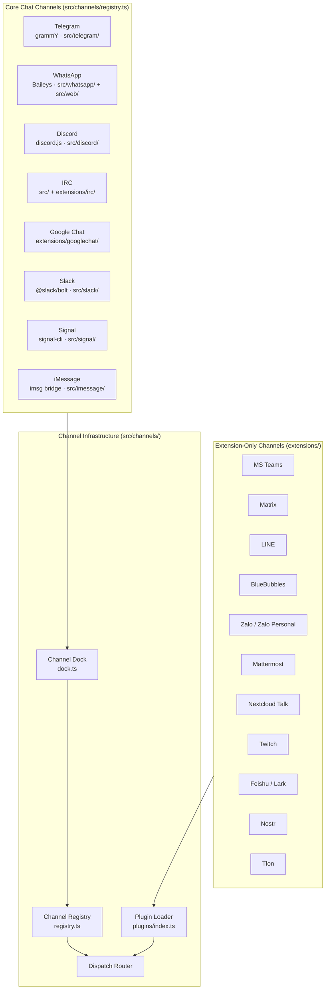

**Default channel:** WhatsApp (`DEFAULT_CHAT_CHANNEL = "whatsapp"`)

### 5.2 Channel Dock Interface

Each channel implements a `ChannelDock` — a lightweight descriptor:

```typescript
ChannelDock {
  id: ChannelId                    // e.g., "telegram", "discord"
  capabilities: {
    chatTypes: ("direct" | "group" | "channel" | "thread")[]
    nativeCommands: boolean        // slash command support
    blockStreaming: boolean        // can receive streamed text
  }
  outbound?: {
    textChunkLimit?: number        // max message length
  }
  elevated?: ...                   // admin features
  config?: ...                     // channel-specific config
  groups?: ...                     // group management
  mentions?: ...                   // @mention handling
  threading?: ...                  // thread/reply support
  agentPrompt?: ...                // channel-specific system prompt
}
```

### 5.3 Channel Plugin Interface

Full plugin adapters extend the dock with richer functionality:

```typescript
ChannelPlugin {
  id: ChannelId
  meta: { name, description, version }
  capabilities: ChannelCapabilities

  // Adapters (optional — implement what you need)
  commands?: ChannelCommandAdapter      // CLI commands
  messaging?: ChannelMessagingAdapter   // Send/receive messages
  outbound?: ChannelOutboundAdapter     // Outbound delivery
  elevated?: ChannelElevatedAdapter     // Admin operations
  groups?: ...                          // Group management
  mentions?: ...                        // @mention resolution
  threading?: ...                       // Thread/reply handling
  status?: ...                          // Health check
  setup?: ...                           // First-time setup
  auth?: ...                            // Authentication
  pairing?: ...                         // DM pairing codes
}
```

### 5.4 Message Flow

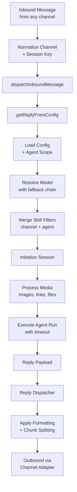

### 5.5 DM Pairing & Security

Channels support a **pairing code** mechanism for unknown senders:

1. Unknown sender sends a DM
2. OpenClaw replies with a pairing code
3. User enters the code via CLI or web UI
4. Sender is added to the allow list
5. Future messages are processed normally

**DM policies:**
- `pairing` (default) — requires code approval
- `open` — accept all DMs (requires explicit opt-in)
- `closed` — reject all unknown DMs

---

## 6. Agent & LLM Orchestration

### 6.1 Agent Runtime

OpenClaw uses the **Pi agent framework** (`@mariozechner/pi-agent-core`) for LLM orchestration:

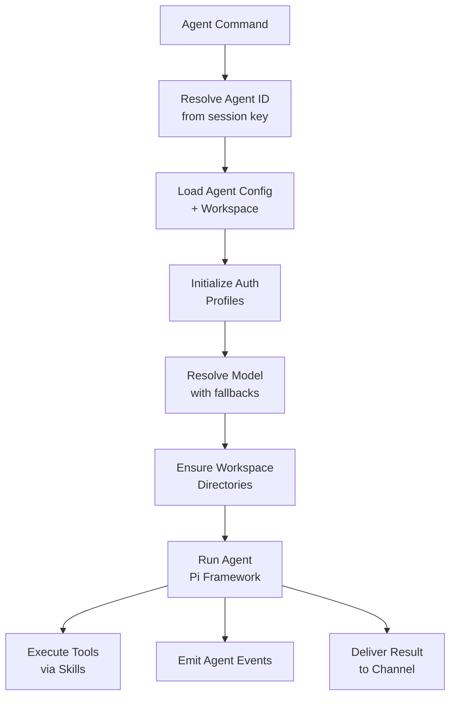

### 6.2 Multi-Agent Routing

OpenClaw supports multiple agents, each with their own configuration:

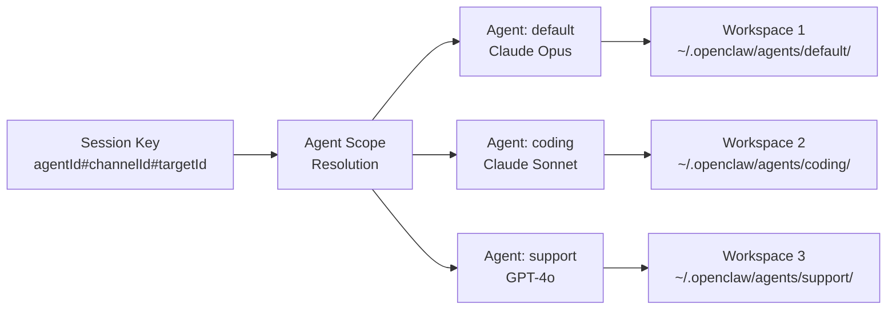

**Session key format:** `agentId#channelId#targetId` or `agentId#sessionId`

**Resolution order:**
1. Extract agent ID from session key
2. Fall back to default agent
3. Resolve agent config (model, skills, tools, temperature)

### 6.3 LLM Provider Support

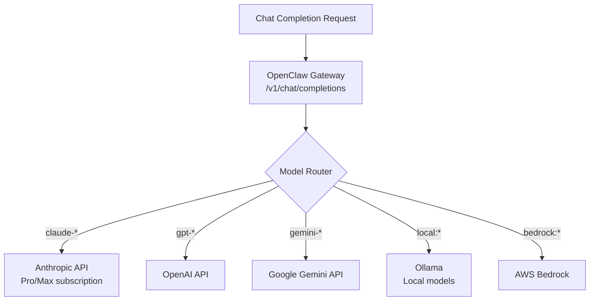

**Key features:**
- OpenAI-compatible API endpoint (`/v1/chat/completions`)
- Model fallback chains (try primary, fall back to secondary)
- Per-agent model configuration
- Subscription-based auth (Anthropic Pro/Max, OpenAI ChatGPT)

### 6.4 Skills & Tools

OpenClaw includes 60+ built-in skills (tools available to the agent):

| Category | Skills |
|----------|--------|
| **Browser** | Web browsing, screenshots, form filling |
| **Canvas** | Live A2UI rendering, interactive visual workspace |
| **Coding** | Code generation, file editing, terminal commands |
| **Apple Notes** | Read/write Apple Notes |
| **1Password** | Password manager integration |
| **Media** | Image processing (Sharp), PDF parsing, audio processing |
| **Communication** | Send messages across channels |
| **Automation** | Cron jobs, webhooks, HTTP requests |
| **Memory** | Vector-based memory (LanceDB) |

---

## 7. Plugin & Extension System

### 7.1 Plugin Architecture

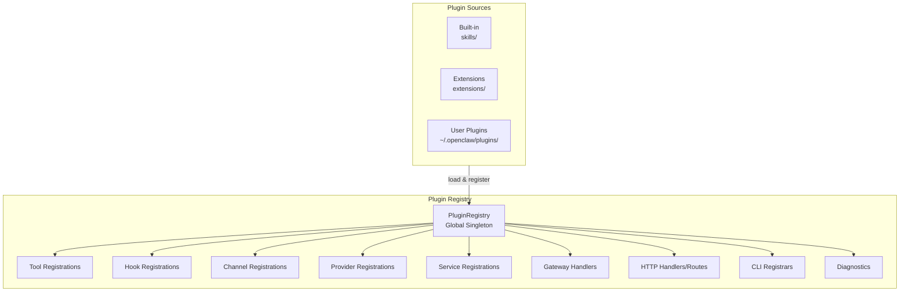

### 7.2 Plugin Record

Each loaded plugin is tracked as a `PluginRecord`:

```typescript
PluginRecord {
  id: string
  name: string
  version: string
  kind: "skill" | "extension" | "channel"
  source: string           // file path
  origin: "built-in" | "custom"
  enabled: boolean
  status: "loaded" | "disabled" | "error"
  toolNames: string[]
  hookNames: string[]
  channelIds: string[]
  providerIds: string[]
  configSchema?: ZodSchema
  configUiHints?: object
}
```

### 7.3 Extension Development

Extensions live in `extensions/` as workspace packages:

```
extensions/
├── discord/          # Discord channel extension
├── telegram/         # Telegram channel extension
├── slack/            # Slack channel extension
├── msteams/          # Microsoft Teams
├── matrix/           # Matrix protocol
├── whatsapp/         # WhatsApp (Baileys)
├── signal/           # Signal protocol
├── voice-call/       # Voice calling
├── memory-core/      # Memory subsystem
├── memory-lancedb/   # Vector DB for memory
└── [30+ more]
```

**Rules for extension development** (from AGENTS.md):
- Keep plugin-only dependencies in the extension's own `package.json`
- Do not add plugin deps to root `package.json` unless core uses them
- Plugin install runs `npm install --omit=dev` in the plugin directory
- Avoid `workspace:*` in dependencies (breaks npm install)
- Put `openclaw` in `devDependencies` or `peerDependencies`
- Runtime resolves `openclaw/plugin-sdk` via jiti alias

---

## 8. Configuration System

### 8.1 Config Architecture

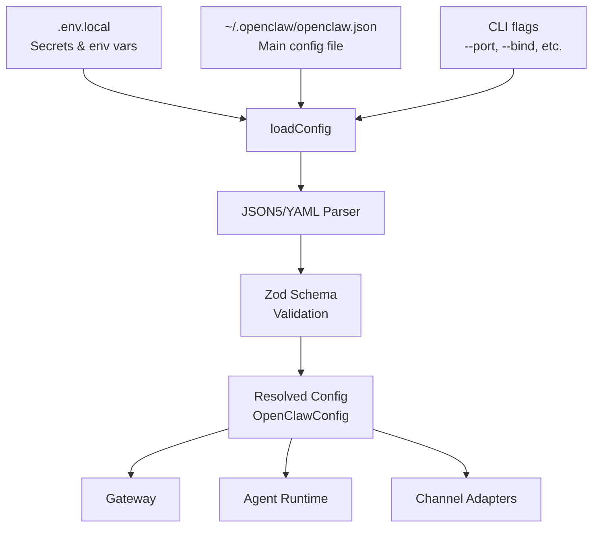

### 8.2 Config Schema

The configuration is validated using **Zod schemas** spread across modular type files:

```
src/config/
├── config.ts              # loadConfig, createConfigIO, writeConfigFile
├── types.ts               # Root export hub
├── types.agents.ts        # Agent definitions, models, skills
├── types.channels.ts      # Channel-specific config
├── types.discord.ts       # Discord-specific
├── types.slack.ts         # Slack-specific
├── types.telegram.ts      # Telegram-specific
├── types.gateway.ts       # Gateway settings
├── types.tools.ts         # Tool definitions
├── types.plugins.ts       # Plugin configuration
└── [15+ more type modules]
```

### 8.3 Sample Configuration

```yaml
gateway:
  port: 18789
  bind: "lan"
  http:
    endpoints:
      chatCompletions:
        enabled: true

agents:
  - id: "default"
    model: "claude-opus-4.6"
    temperature: 0.7
    skills:
      enabled: ["browser", "canvas", "coding-agent"]

channels:
  telegram:
    enabled: true
    token: "YOUR_BOT_TOKEN"
    dmPolicy: "pairing"
    allowFrom: ["123456789"]
  discord:
    enabled: true
    token: "YOUR_DISCORD_TOKEN"
  whatsapp:
    enabled: true

talk:
  enabled: true
  apiKey: "YOUR_ELEVENLABS_KEY"
  voices: ["21m00Tcm4TlvDq8ikWAM"]
```

### 8.4 Config Storage Locations

| Path | Purpose |
|------|---------|
| `~/.openclaw/openclaw.json` | Main configuration (YAML/JSON) |
| `~/.openclaw/credentials/` | Encrypted provider credentials |
| `~/.openclaw/sessions/` | Persisted session data (SQLite) |
| `~/.openclaw/agents/` | Per-agent workspace directories |
| `~/.openclaw/plugins/` | User-installed plugins |
| `.env.local` | Environment secrets (gitignored) |

---

## 9. Session & State Management

### 9.1 Session Model

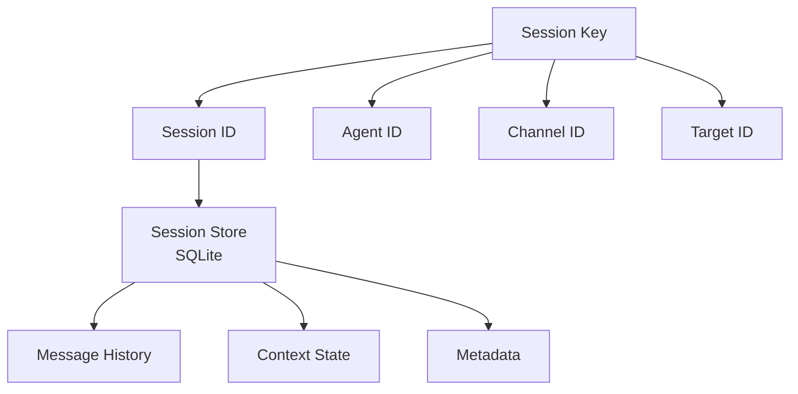

**Session key format:** `agentId#channelId#targetId`

**Session kinds:**
- `main` — primary user conversation
- `group` — group chat session
- `cron` — scheduled task session
- `hook` — webhook-triggered session
- `node` — device node session
- `other` — custom sessions

### 9.2 Session Lifecycle

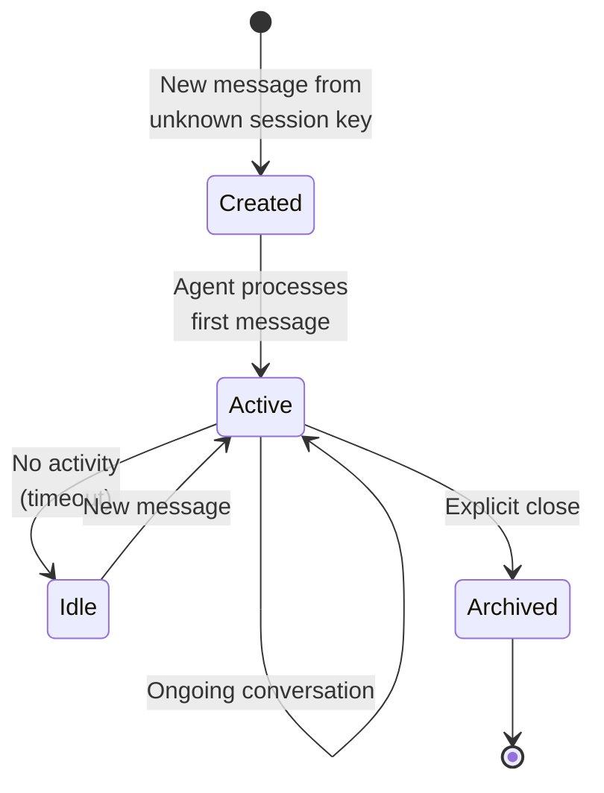

### 9.3 State Persistence

- **Session store:** SQLite in `~/.openclaw/sessions/`
- **Per-agent isolation:** Each agent has its own workspace directory
- **Concurrency control:** Configurable max concurrent messages per agent
- **Queue mode:** Messages can be queued when agent is busy

---

## 10. Security Architecture

### 10.1 Security Layers

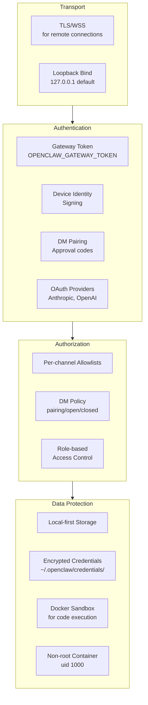

### 10.2 Security Defaults

| Setting | Default | Notes |
|---------|---------|-------|
| Gateway bind | `127.0.0.1` (loopback) | Must explicitly opt into LAN/remote |
| DM policy | `pairing` | Unknown senders get approval code |
| Docker user | `node` (uid 1000) | Non-root execution |
| Config permissions | User-only readable | `~/.openclaw/` directory |
| Transport | Plain WS locally, WSS required for remote | TLS fingerprint validation |
| Code execution | Sandboxed (Docker) | Optional, opt-in |

### 10.3 Credential Management

- **Provider API keys:** Stored in `~/.openclaw/credentials/` (encrypted)
- **Channel tokens:** In main config file (user-readable only)
- **OAuth sessions:** Per-provider in credentials directory
- **Environment secrets:** `.env.local` (gitignored, never committed)

---

## 11. Data Models & Key Types

### 11.1 Core TypeScript Types

```typescript
// Session
type Session = {
  id: string
  userId: string
  kind: "main" | "group" | "cron" | "hook" | "node" | "other"
  messages: Message[]
  context: object
  metadata: SessionMetadata
  activationMode?: string
  queueMode?: string
}

// Message
type Message = {
  id: string
  sender: string
  channelId: ChannelId
  content: string
  attachments?: Attachment[]
  timestamp: number
  inReplyTo?: string
  reactions?: Record<string, string[]>
}

// Attachment
type Attachment = {
  type: "image" | "video" | "audio" | "file"
  data: Buffer
  mimeType: string
  url?: string
  metadata?: object
}

// Agent Configuration
type AgentConfig = {
  model: string
  temperature?: number
  maxTokens?: number
  systemPrompt?: string
  tools?: Tool[]
  thinking?: "none" | "low" | "medium" | "high"
}
```

### 11.2 Voice Stream Protocol

```typescript
// Cheeko WebSocket messages
type CheekStreamMessage =
  | { type: "hello"; deviceId: string }
  | { type: "audio"; opusFrame: Buffer }
  | { type: "audio_end" }
  | { type: "transcript"; text: string; isFinal: boolean }
  | { type: "audio_ready"; opusFrame: Buffer }
  | { type: "error"; message: string }
  | { type: "close" }
```

### 11.3 Plugin Registry Types

```typescript
type PluginRegistry = {
  plugins: PluginRecord[]
  tools: PluginToolRegistration[]
  hooks: PluginHookRegistration[]
  channels: PluginChannelRegistration[]
  providers: PluginProviderRegistration[]
  services: PluginServiceRegistration[]
  gatewayHandlers: GatewayRequestHandlers
  httpHandlers: HttpHandler[]
  httpRoutes: HttpRoute[]
  cliRegistrars: CLIRegistrar[]
  commands: PluginCommandDefinition[]
  diagnostics: PluginDiagnostic[]
}
```

---

## 12. API Reference

### 12.1 HTTP Endpoints

| Endpoint | Method | Purpose |
|----------|--------|---------|
| `/v1/chat/completions` | POST | OpenAI-compatible LLM endpoint |
| `/cheeko/stream` | WS | Voice streaming (Opus/PCM audio + JSON control) |
| `/gateway/config` | GET | Configuration management |
| `/gateway/status` | GET | Health check & status |
| `/sessions` | GET/POST | Session list & management |
| `/sessions/{id}` | GET/PUT/DELETE | Individual session operations |
| `/messages` | POST | Send message to session |
| `/channels` | GET | List active channels |
| `/channels/{id}/send` | POST | Send to specific channel |
| `/control-ui` | GET/WS | Control interface & real-time updates |
| `/webhooks/*` | POST | Webhook delivery & event streaming |

### 12.2 WebSocket Protocols

**Gateway Control Plane (port 18789):**
- Real-time events, presence updates, config reloads
- Request/response correlation via sequence numbers
- Used by CLI, web UI, mobile apps

**Cheeko Voice Stream (`/cheeko/stream`):**
- Binary: Opus audio frames (16kHz 16-bit mono)
- Text: JSON control messages
- Handshake: `{ type: "hello", deviceId: "..." }`

### 12.3 Cheeko Voice Stream API

See [Section 4.7](#47-websocket-protocol) for the full WebSocket protocol reference (message types, audio framing, and control flow).

---

## 13. Frontend & Native Apps

### 13.1 Web UI

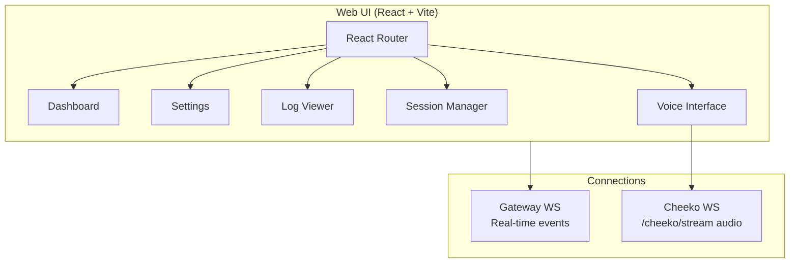

**Stack:** React + TypeScript, Vite bundler

### 13.2 Native Apps

| Platform | Technology | Features |
|----------|-----------|----------|
| **macOS** | Swift/SwiftUI | Menu bar app, Canvas (A2UI), Voice Wake, gateway management |
| **iOS** | Swift/SwiftUI | Companion node, Canvas, Voice, push notifications |
| **Android** | Kotlin | Companion node, Canvas, Talk mode, WebView |

**macOS specifics:**
- Gateway runs as menu bar app (not a separate LaunchAgent)
- Uses Observation framework (`@Observable`, `@Bindable`)
- WebKit embed for web-based views
- Voice Wake for hands-free activation

### 13.3 Canvas (A2UI)

A live, interactive visual workspace that the agent can render:
- Real-time rendering of agent-generated UI
- Interactive components (forms, charts, visualizations)
- Available on macOS, iOS, and Android

---

## 14. Deployment Architecture

### 14.1 Deployment Options

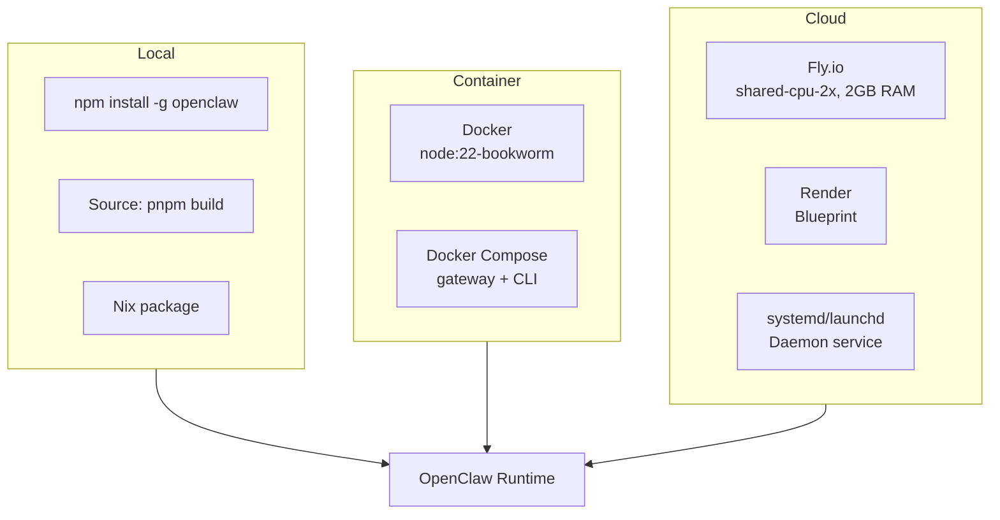

### 14.2 Docker Image

```dockerfile
# Base: node:22-bookworm
# Installs: Bun (optional), corepack (pnpm)
# Build: pnpm install → pnpm build → pnpm ui:build
# Runtime: Non-root (node, uid 1000)
# CMD: node openclaw.mjs gateway --allow-unconfigured
```

### 14.3 Docker Compose

Two services:
- **openclaw-gateway:** The control plane (ports 18789, 18790)
- **openclaw-cli:** Interactive CLI (tty enabled)

Volumes mount `~/.openclaw/` for persistent config and workspaces.

### 14.4 Fly.io

- **Region:** `iad` (US East)
- **VM:** `shared-cpu-2x`, 2048MB RAM
- **Storage:** Persistent volume at `/data`
- **Port:** 3000 (internal), HTTPS forced
- **Node options:** `--max-old-space-size=1536`
- **Auto-stop:** Disabled (persistent WebSocket connections)

### 14.5 Port Mapping

| Port | Service | Notes |
|------|---------|-------|
| 18789 | Gateway control plane + Cheeko voice | Default, configurable |
| 18790 | Bridge (optional) | Secondary connections |
| 3000 | Fly.io HTTP | Cloud deployment only |

---

## 15. Development Workflow

### 15.1 Setup

```bash
# Clone and install
git clone https://github.com/openclaw/openclaw.git
cd openclaw
pnpm install

# Build everything
pnpm build
pnpm ui:build

# First-time setup
pnpm openclaw onboard --install-daemon
```

### 15.2 Development Commands

| Command | Purpose |
|---------|---------|
| `pnpm install` | Install all dependencies |
| `pnpm build` | TypeScript → JavaScript (tsdown) |
| `pnpm check` | Format (oxfmt) + lint (oxlint) + type-check |
| `pnpm test` | Run vitest test suite |
| `pnpm test:coverage` | Coverage report (70% threshold) |
| `pnpm gateway:watch` | Auto-reload gateway on changes |
| `pnpm ui:dev` | Vite dev server for web UI |
| `pnpm openclaw ...` | Run CLI via tsx |

### 15.3 Coding Conventions

- **Language:** TypeScript (ESM), strict mode, no `any`
- **Formatting:** oxlint + oxfmt (Rust-based, fast)
- **File size:** ~700 LOC guideline (not a hard limit)
- **Comments:** Brief, only for tricky logic
- **Naming:** "OpenClaw" in docs, `openclaw` in code/config
- **Tests:** Colocated `*.test.ts` files, Vitest + V8 coverage

### 15.4 Commit & PR Workflow

- Use `scripts/committer "<msg>" <file...>` for commits
- Concise, action-oriented commit messages
- Full PR workflow documented in `.agents/skills/PR_WORKFLOW.md`
- Pre-commit hooks via `prek install`

---

## 16. Observability & Diagnostics

### 16.1 Logging

- **Framework:** tslog (structured logging)
- **Console capture:** `enableConsoleCapture()` at startup
- **CLI access:** `openclaw logs`

### 16.2 Diagnostics

```bash
# Comprehensive health check
openclaw doctor

# Channel connectivity probe
openclaw channels status --probe

# Gateway health
openclaw gateway status

# HTTP health endpoint
GET /gateway/status
```

### 16.3 Monitoring

- **OpenTelemetry:** Optional via `otel` extension
- **Terminal dashboard:** `openclaw dashboard`
- **Session inspector:** Via web UI or CLI

---

## 17. Roadmap & Future Directions

### Active Development

- **Voice pipeline maturation:** Latency optimization, multi-provider TTS benchmarking, turn-taking improvements
- **ElevenLabs TTS integration:** Recently added as configurable alternative to Edge TTS
- **End-to-end voice testing:** Automated test suite for the full STT → LLM → TTS pipeline

### Planned Improvements

- **Voice Wake improvements:** Better wake word detection, lower latency activation
- **Multi-modal support:** Image and document understanding in voice conversations
- **Agent collaboration:** Multiple agents working together on complex tasks
- **Memory system enhancements:** Better long-term memory with vector search (LanceDB)
- **Channel parity:** Ensuring feature consistency across all 40+ channels
- **Plugin marketplace:** Discoverable, installable community plugins

### Architectural Considerations

- **Horizontal scaling:** Moving from single-instance to multi-instance gateway
- **Edge deployment:** Running lightweight agents on edge devices (IoT, Raspberry Pi)
- **Federated architecture:** Multiple OpenClaw instances sharing context
- **Streaming optimization:** Reducing end-to-end voice latency below 500ms

### Known Technical Debt

- Large TypeScript source (~340k LOC) — ongoing modularization
- Extension install uses `npm install` (could benefit from unified pnpm)
- Config schema spread across 15+ type files — consolidation opportunity

---

## Appendix A: Directory Structure

```
openclaw/
├── src/                          # Core TypeScript source
│   ├── index.ts                  # CLI entry point
│   ├── entry.ts                  # Process bootstrap
│   ├── gateway/                  # WebSocket control plane
│   ├── channels/                 # Multi-channel adapters
│   ├── config/                   # Config loading & validation
│   ├── agents/                   # Agent runtime & workspaces
│   ├── plugins/                  # Plugin registry & runtime
│   ├── auto-reply/               # Message dispatch & reply
│   ├── commands/                 # CLI command handlers
│   ├── cli/                      # CLI infrastructure
│   ├── media/                    # Image/audio/video processing
│   ├── browser/                  # Playwright browser automation
│   ├── acp/                      # Agent Client Protocol
│   ├── extensions/               # Extension loader
│   ├── hooks/                    # Webhook & event system
│   ├── sandbox/                  # Sandboxed code execution
│   ├── web/                      # Web channel/interface
│   ├── infra/                    # Infrastructure (ports, env)
│   ├── discord/                  # Discord channel core
│   ├── telegram/                 # Telegram channel core
│   ├── slack/                    # Slack channel core
│   ├── signal/                   # Signal channel core
│   ├── imessage/                 # iMessage integration
│   └── logging.ts                # Structured logging
│
├── extensions/                   # Plugin workspace packages (40+)
├── skills/                       # Built-in skills/tools (60+)
├── packages/                     # Workspace packages
│   ├── clawdbot/                 # Multi-channel bot
│   └── moltbot/                  # Alternative bot
│
├── ui/                           # React web UI (Vite)
├── apps/                         # Native applications
│   ├── macos/                    # Swift/SwiftUI menu bar app
│   ├── ios/                      # iOS companion app
│   └── android/                  # Android companion app
│
├── docs/                         # Documentation (Mintlify)
├── scripts/                      # Build & automation scripts
├── test/                         # Test suites
├── dist/                         # Compiled output
│
├── package.json                  # Main dependencies
├── pnpm-workspace.yaml           # Monorepo workspace config
├── tsconfig.json                 # TypeScript config
├── Dockerfile                    # Container image
├── docker-compose.yml            # Multi-service orchestration
├── fly.toml                      # Fly.io deployment
└── render.yaml                   # Render deployment
```

## Appendix B: Dependency Map

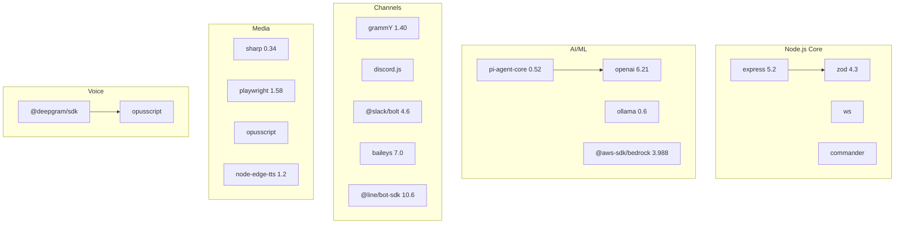

## Appendix C: Environment Variables

| Variable | Required | Description |
|----------|----------|-------------|
| `OPENCLAW_GATEWAY_TOKEN` | Yes (remote) | Gateway authentication token |
| `DEEPGRAM_API_KEY` | Cheeko voice | Deepgram STT API key |
| `OPENAI_API_KEY` | Optional | OpenAI API key (LLM + TTS) |
| `ELEVENLABS_API_KEY` | Optional | ElevenLabs TTS API key |
| `XI_API_KEY` | Optional | ElevenLabs TTS API key (alias) |
| `CLAUDE_AI_SESSION_KEY` | Optional | Anthropic session key |

---

*This document is maintained alongside the codebase. For the latest updates, see the [docs/](.) directory and [AGENTS.md](../AGENTS.md).*
